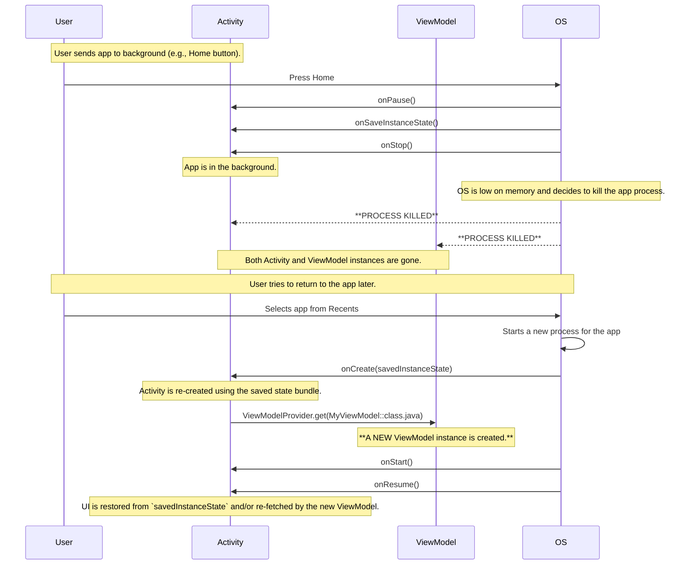

## {{ page.title }}

```mermaid
sequenceDiagram
    participant User
    participant Activity
    participant ViewModel
    participant OS

    Note over User, Activity: User sends app to background (e.g., Home button).
    User->>OS: Press Home
    OS->>Activity: onPause()
    OS->>Activity: onSaveInstanceState()
    OS->>Activity: onStop()
    Note over Activity: App is in the background.

    Note over OS: OS is low on memory and decides to kill the app process.
    OS-->>Activity: **PROCESS KILLED**
    OS-->>ViewModel: **PROCESS KILLED**
    Note over Activity, ViewModel: Both Activity and ViewModel instances are gone.

    Note over User, OS: User tries to return to the app later.
    User->>OS: Selects app from Recents
    OS->>OS: Starts a new process for the app
    OS->>Activity: onCreate(savedInstanceState)
    Note over Activity: Activity is re-created using the saved state bundle.
    
    Activity->>ViewModel: ViewModelProvider.get(MyViewModel::class.java)
    Note over ViewModel: **A NEW ViewModel instance is created.**

    OS->>Activity: onStart()
    OS->>Activity: onResume()
    Note over Activity: UI is restored from `savedInstanceState` and/or re-fetched by the new ViewModel.
```
