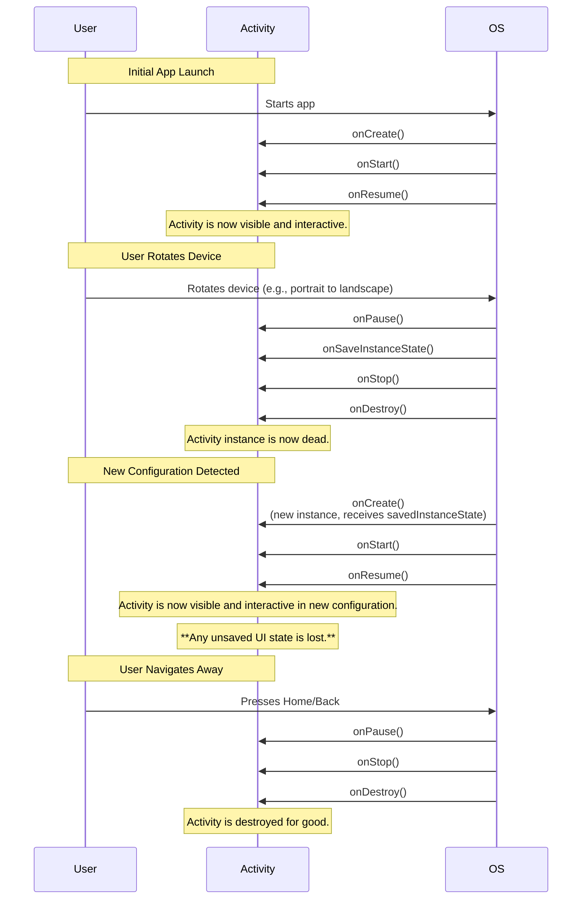

## {{ page.title }}

```mermaid
sequenceDiagram
    participant User
    participant Activity
    participant OS

    Note over User,Activity: Initial App Launch
    User->>OS: Starts app
    OS->>Activity: onCreate()
    OS->>Activity: onStart()
    OS->>Activity: onResume()
    Note over Activity: Activity is now visible and interactive.

    Note over User,Activity: User Rotates Device
    User->>OS: Rotates device (e.g., portrait to landscape)
    OS->>Activity: onPause()
    OS->>Activity: onSaveInstanceState()
    OS->>Activity: onStop()
    OS->>Activity: onDestroy()
    Note over Activity: Activity instance is now dead.

    Note over User,Activity: New Configuration Detected
    OS->>Activity: onCreate() <br> (new instance, receives savedInstanceState)
    OS->>Activity: onStart()
    OS->>Activity: onResume()
    Note over Activity: Activity is now visible and interactive in new configuration.
    Note over Activity: **Any unsaved UI state is lost.**

    Note over User,Activity: User Navigates Away
    User->>OS: Presses Home/Back
    OS->>Activity: onPause()
    OS->>Activity: onStop()
    OS->>Activity: onDestroy()
    Note over Activity: Activity is destroyed for good.
```
