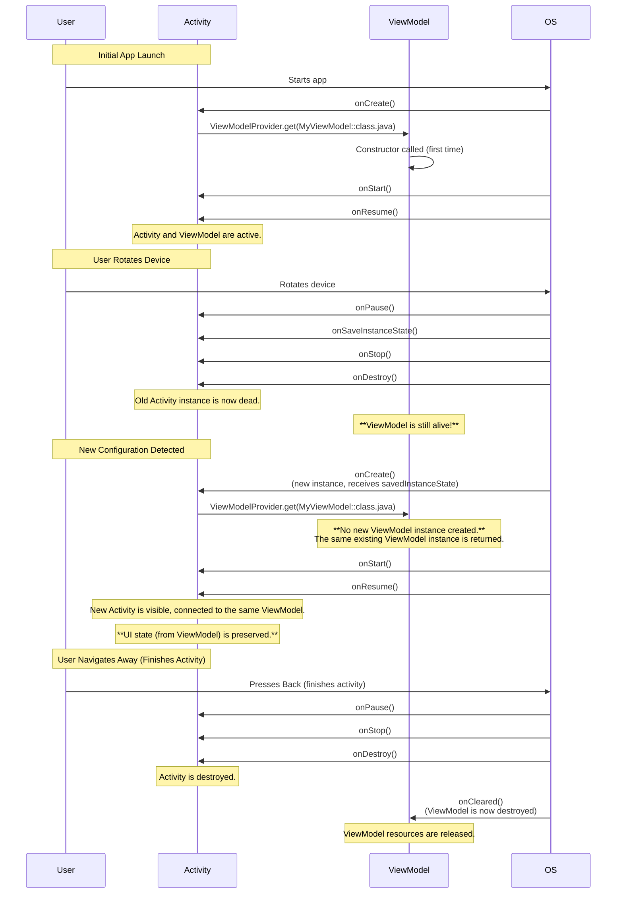

## {{ page.title }}

```mermaid
sequenceDiagram
    participant User
    participant Activity
    participant ViewModel
    participant OS

    Note over User,Activity: Initial App Launch
    User->>OS: Starts app
    OS->>Activity: onCreate()
    Activity->>ViewModel: ViewModelProvider.get(MyViewModel::class.java)
    ViewModel->>ViewModel: Constructor called (first time)
    OS->>Activity: onStart()
    OS->>Activity: onResume()
    Note over Activity: Activity and ViewModel are active.

    Note over User,Activity: User Rotates Device
    User->>OS: Rotates device
    OS->>Activity: onPause()
    OS->>Activity: onSaveInstanceState()
    OS->>Activity: onStop()
    OS->>Activity: onDestroy()
    Note over Activity: Old Activity instance is now dead.
    Note over ViewModel: **ViewModel is still alive!**

    Note over User,Activity: New Configuration Detected
    OS->>Activity: onCreate() <br> (new instance, receives savedInstanceState)
    Activity->>ViewModel: ViewModelProvider.get(MyViewModel::class.java)
    Note over ViewModel: **No new ViewModel instance created.** <br> The same existing ViewModel instance is returned.
    OS->>Activity: onStart()
    OS->>Activity: onResume()
    Note over Activity: New Activity is visible, connected to the same ViewModel.
    Note over Activity: **UI state (from ViewModel) is preserved.**

    Note over User,Activity: User Navigates Away (Finishes Activity)
    User->>OS: Presses Back (finishes activity)
    OS->>Activity: onPause()
    OS->>Activity: onStop()
    OS->>Activity: onDestroy()
    Note over Activity: Activity is destroyed.
    OS->>ViewModel: onCleared() <br> (ViewModel is now destroyed)
    Note over ViewModel: ViewModel resources are released.
```
