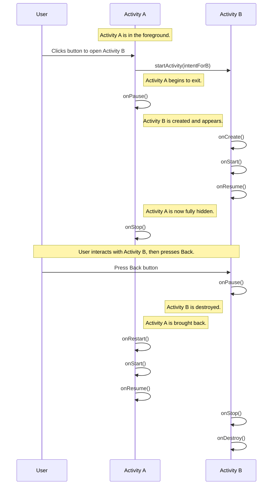

## {{ page.title }}

```mermaid
sequenceDiagram
    participant User
    participant Activity A
    participant Activity B

    Note over Activity A: Activity A is in the foreground.
    User->>Activity A: Clicks button to open Activity B
    Activity A->>Activity B: startActivity(intentForB)
    
    Note right of Activity A: Activity A begins to exit.
    Activity A->>Activity A: onPause()

    Note left of Activity B: Activity B is created and appears.
    Activity B->>Activity B: onCreate()
    Activity B->>Activity B: onStart()
    Activity B->>Activity B: onResume()
    
    Note right of Activity A: Activity A is now fully hidden.
    Activity A->>Activity A: onStop()

    Note over User, Activity B: User interacts with Activity B, then presses Back.
    User->>Activity B: Press Back button
    Activity B->>Activity B: onPause()
    
    Note left of Activity B: Activity B is destroyed.
    Note right of Activity A: Activity A is brought back.
    Activity A->>Activity A: onRestart()
    Activity A->>Activity A: onStart()
    Activity A->>Activity A: onResume()

    Activity B->>Activity B: onStop()
    Activity B->>Activity B: onDestroy()
```
