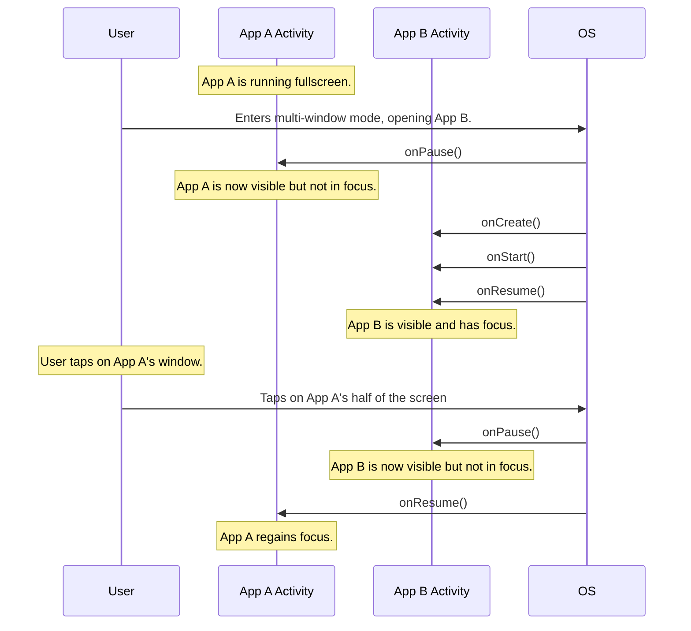

## {{ page.title }}

```mermaid
sequenceDiagram
    participant User
    participant App A Activity
    participant App B Activity
    participant OS

    Note over App A Activity: App A is running fullscreen.
    User->>OS: Enters multi-window mode, opening App B.
    
    OS->>App A Activity: onPause()
    Note over App A Activity: App A is now visible but not in focus.
    
    OS->>App B Activity: onCreate()
    OS->>App B Activity: onStart()
    OS->>App B Activity: onResume()
    Note over App B Activity: App B is visible and has focus.

    Note over User: User taps on App A's window.
    User->>OS: Taps on App A's half of the screen
    OS->>App B Activity: onPause()
    Note over App B Activity: App B is now visible but not in focus.
    
    OS->>App A Activity: onResume()
    Note over App A Activity: App A regains focus.
```
